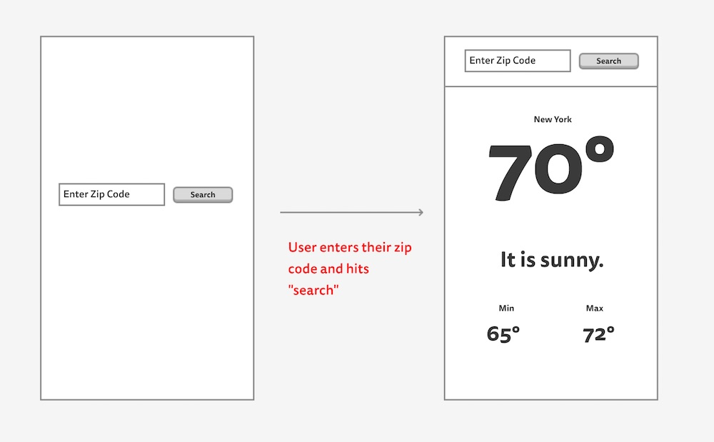

# Building a weather app!!

Here's an exciting challenge: You'll be building a small weather app, using your newfound skills with APIs!

## Setting up

#### 🚀 Make sure you follow all of these steps!

For this homework you'll be using your newfound knowledge of AJAX requests using the Open Weather API!!!

1. Sign up for a free [Open Weather Map](https://home.openweathermap.org/users/sign_up) account!
2. Once you've signed up, you're given an [API key](https://home.openweathermap.org/api_keys). Copy that API key and keep track of it somewhere!
3. Open Postman to check out the data you're working with & to verify that your key works. Make a GET request to the following URL in postman, adding your API key to the end.
4. Read the API documentation carefully, to make sure you know how to make each request!

```
http://api.openweathermap.org/data/2.5/weather?q=10025,us?units=imperial&appid=[PUT YOUR API KEY HERE]
```

#### You'll be working in `index.html`, `src/main.js`, and `styles/style.css`.

## In the end, your weather app will look like this in the mobile view:



## Your page should have:
- An input field for a user to enter a zip code
- A submit button
- When the submit button is clicked:
    - A GET request should fetch the weather data from the API
    - The following data should be rendered on the page:
        - City name
        - Current temperature
        - Weather description
        - Min temp
        - Max temp

Here are some zip codes to test!
- 99501 (Anchorage)
- 99723 (Barrow, AK)
- 60605 (Chicago)
- 70124 (New Orleans)
- 77030 (Houston, TX)
- 00902 (San Juan, Puerto Rico)
- 46923 (Delphi, IN)
- 94123 (San Francisco, CA)


## BONUSES!!

- Have the temperature turn blue if under 40, and red if above 90.
- Add the latitude and longitude, humidity, precipitation, and wind speed
- Add FontAwesome icons
- Add sunrise and sunset times (look into [the javascript date object](https://developer.mozilla.org/en-US/docs/Web/JavaScript/Reference/Global_Objects/Date)... if you dare!!!)
- Get the desktop view to work like this:


